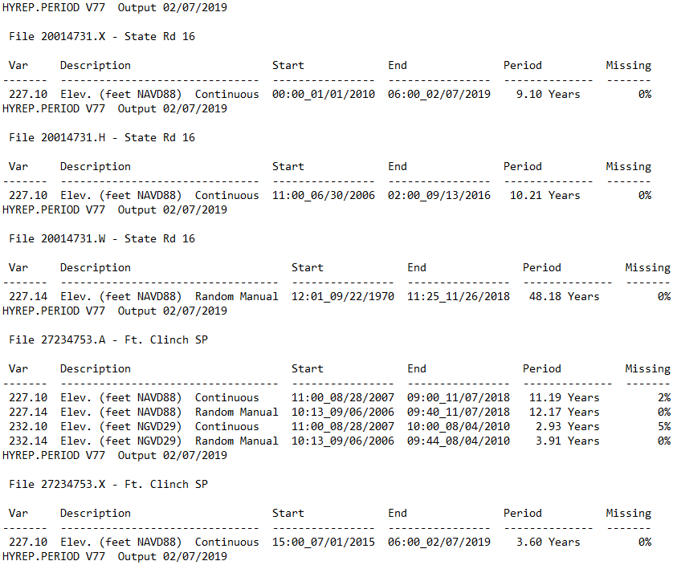

```{r setup, include = F}
knitr::opts_chunk$set(echo = TRUE)
```

```{r, include = F}
library(dplyr)
library(tidyr)
library(stringr)
library(tibble)
```


I was trying to get the period of record for data in the St. Johns River Water Management District's Hydstra database, which houses hydrologic data.  I found the report type HYREP PERIOD, which produces an output that contains the period of record information I needed.  However, it was not in a convenient format to allow for easy joining to other tables in Oracle-based tables.  This project steps through the data cleaning process I went through to get the data into a usable format in R.

## HYREP PERIOD data output

The HYREP PERIOD report produces an output that would be very good on a small scale (i.e., looking at only a few stations at a time):



## 
```{r}
# Load text file exported from HYREP PERIOD
hy <- data.frame(V1 = readLines("HY_POR_WATERCAT.txt", skipNul = T))
head(hy, 10)
```

## Remove unnecessary lines and whitespace
```{r}
hy <- hy %>% 
    filter(!grepl("--|HYREP.PERIOD|Var|dup/|Index", V1), V1 != "") %>% 
    mutate(V1 = str_trim(V1))
head(hy, 10)
```

## New Site variable, filling down
```{r}
hy <- hy %>% 
    mutate(Site = str_extract(V1, "\\d{8}"))
hy <- fill(hy, Site)
```


Extract the variable, start date, and end date from the Hydstra output
Omit all subvariables except 0.10 and 0.14
Omit variables 104 (Static Head), 252 (X-Section Area), 551 (Barometric pressure)
```{r}
hy <- hy %>% 
    mutate(Variable = str_extract(V1, "^\\d+\\.\\d+"),
           StartDate = as.POSIXct(str_extract(V1, "\\d{2}\\:\\d{2}\\_\\d{2}/\\d{2}/\\d{4}"),
                               format = "%H:%M_%m/%d/%Y", tz = "EST"),
           EndDate = as.POSIXct(str_sub(str_extract(V1, "\\d{2}\\:\\d{2}\\_\\d{2}/\\d{2}/\\d{4}.*?(\\d{2}\\:\\d{2}\\_\\d{2}/\\d{2}/\\d{4})"), -16),
                                format = "%H:%M_%m/%d/%Y", tz = "EST"),
           Var = as.numeric(str_extract(Variable, ".*(?=\\.)")),
           SubVar = as.numeric(str_extract(Variable, "(\\.[^\\.]+)$")
           )) %>% 
    filter(SubVar %in% c(0.1, 0.14), !(Var %in% c(104, 252, 551)))
```

Summarize by Site and variable
```{r}
hy_sum <- hy %>% 
    group_by(Site, Var) %>% 
    summarize(Start = min(StartDate), End = max(EndDate))
```


Read in Event Type Hydstra Variable Crosswalk table

```{r}
var_xwalk <- read.csv("Event_Var_Xwalk.csv")
```


```{r}
hy_sum <- hy_sum %>% 
    mutate(Event = paste(as.character(var_xwalk$Event.Type[var_xwalk$Var == Var]),
                         collapse = ";", sep = " "))
```

hy_sum$Event <- NA
for(i in 1:nrow(hy_sum)) {
    hy_sum$Event[i] <- paste(as.character(var_xwalk$Event.Type[var_xwalk$Var == hy_sum$Var[i]]), collapse = ";", sep = " ")
}

hy_sum <- hy_sum %>% 
    group_by(Site, Event) %>% 
    summarize(Start = min(Start), End = max(End))


hy_sum <- hy_sum %>% 
    mutate(Event = strsplit(as.character(Event), ";")) %>%
    unnest(Event)

hy_sum <- hy_sum %>% 
    group_by(Site, Event) %>% 
    summarize(Start = min(Start), End = max(End))


