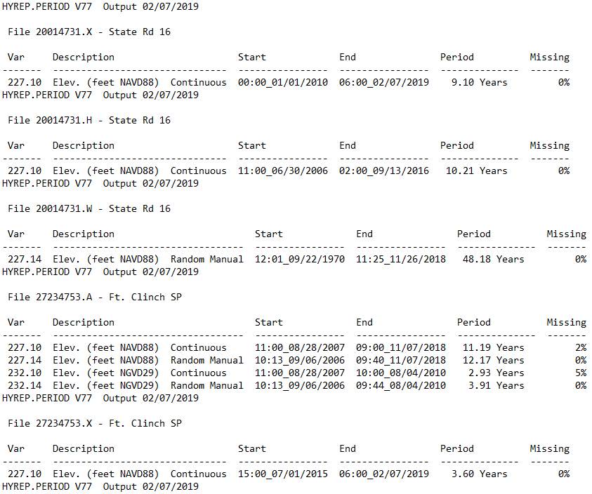

I was trying to get the period of record for data in the St. Johns River
Water Management District’s Hydstra database, which houses hydrologic
data. I found the report type HYREP PERIOD, which produces an output
that contains the period of record information I needed. However, it was
not in a convenient format to allow for easy joining to other tables in
Oracle-based tables. This project steps through the data cleaning
process I went through to get the data into a usable format in R.

## HYREP PERIOD data output

The HYREP PERIOD report produces an output that would be very good on a
small scale (i.e., looking at only a few stations at a time):



## 

``` r
# Load text file exported from HYREP PERIOD
hy <- data.frame(V1 = readLines("HY_POR_WATERCAT.txt", skipNul = T))
head(hy, 20)
```

    ##                                                                                                          V1
    ## 1                                                                       HYREP.PERIOD V77  Output 02/07/2019
    ## 2                                                                                                          
    ## 3                                                                             File 20014731.A - State Rd 16
    ## 4                                                                                                          
    ## 5   Var     Description                         Start             End               Period          Missing
    ## 6  -------  ----------------------------------  ----------------  ----------------  --------------  -------
    ## 7   227.10  Elev. (feet NAVD88)  Continuous     11:00_06/30/2006  11:00_07/10/2018   12.03 Years         0%
    ## 8   227.14  Elev. (feet NAVD88)  Random Manual  12:01_09/22/1970  11:35_07/10/2018   47.80 Years         0%
    ## 9   232.10  Elev. (feet NGVD29)  Continuous     11:00_06/30/2006  11:00_03/01/2010    3.67 Years         0%
    ## 10  232.14  Elev. (feet NGVD29)  Random Manual  12:01_09/22/1970  11:14_03/01/2010   39.44 Years         0%
    ## 11                                                                      HYREP.PERIOD V77  Output 02/07/2019
    ## 12                                                                                                         
    ## 13                                                                            File 20014731.X - State Rd 16
    ## 14                                                                                                         
    ## 15     Var     Description                      Start             End               Period          Missing
    ## 16    -------  -------------------------------  ----------------  ----------------  --------------  -------
    ## 17     227.10  Elev. (feet NAVD88)  Continuous  00:00_01/01/2010  06:00_02/07/2019    9.10 Years         0%
    ## 18                                                                      HYREP.PERIOD V77  Output 02/07/2019
    ## 19                                                                                                         
    ## 20                                                                            File 20014731.H - State Rd 16

## Remove unnecessary lines

``` r
hy <- hy %>% 
    filter(!grepl("--|HYREP.PERIOD|Var", V1), V1 != "")
head(hy, 20)
```

    ##                                                                                                          V1
    ## 1                                                                             File 20014731.A - State Rd 16
    ## 2   227.10  Elev. (feet NAVD88)  Continuous     11:00_06/30/2006  11:00_07/10/2018   12.03 Years         0%
    ## 3   227.14  Elev. (feet NAVD88)  Random Manual  12:01_09/22/1970  11:35_07/10/2018   47.80 Years         0%
    ## 4   232.10  Elev. (feet NGVD29)  Continuous     11:00_06/30/2006  11:00_03/01/2010    3.67 Years         0%
    ## 5   232.14  Elev. (feet NGVD29)  Random Manual  12:01_09/22/1970  11:14_03/01/2010   39.44 Years         0%
    ## 6                                                                             File 20014731.X - State Rd 16
    ## 7      227.10  Elev. (feet NAVD88)  Continuous  00:00_01/01/2010  06:00_02/07/2019    9.10 Years         0%
    ## 8                                                                             File 20014731.H - State Rd 16
    ## 9      227.10  Elev. (feet NAVD88)  Continuous  11:00_06/30/2006  02:00_09/13/2016   10.21 Years         0%
    ## 10                                                                            File 20014731.W - State Rd 16
    ## 11  227.14  Elev. (feet NAVD88)  Random Manual  12:01_09/22/1970  11:25_11/26/2018   48.18 Years         0%
    ## 12                                                                          File 27234753.A - Ft. Clinch SP
    ## 13  227.10  Elev. (feet NAVD88)  Continuous     11:00_08/28/2007  09:00_11/07/2018   11.19 Years         2%
    ## 14  227.14  Elev. (feet NAVD88)  Random Manual  10:13_09/06/2006  09:40_11/07/2018   12.17 Years         0%
    ## 15  232.10  Elev. (feet NGVD29)  Continuous     11:00_08/28/2007  10:00_08/04/2010    2.93 Years         5%
    ## 16  232.14  Elev. (feet NGVD29)  Random Manual  10:13_09/06/2006  09:44_08/04/2010    3.91 Years         0%
    ## 17                                                                          File 27234753.X - Ft. Clinch SP
    ## 18     227.10  Elev. (feet NAVD88)  Continuous  15:00_07/01/2015  06:00_02/07/2019    3.60 Years         0%
    ## 19                                                                          File 27234753.W - Ft. Clinch SP
    ## 20  227.14  Elev. (feet NAVD88)  Random Manual  10:13_09/06/2006  09:40_11/07/2018   12.17 Years         0%

## Create new, empty, variables

hy\(Site <- hy\)Variable \<- hy\(StartDate <- hy\)EndDate \<- NA

## Populate the Site variable with the Hydron ID from the File row

for(i in 1:nrow(hy)) { if(grepl(“\\d{8}”, hy\(V1[i])) {  hy\)Site\[i\]
\<- regmatches(hy\(V1[i],  regexpr("\\d{8}", hy\)V1\[i\])) } }

## Fill down the Hydron ID to associate the variables

## with the appropriate Hydron ID

hy \<- fill(hy, Site)

## Remove unnecessary lines

hy \<- hy %\>% filter(\!grepl(“File”, V1), \!grepl(“Index”, V1),
\!grepl(“Differences”, V1), \!grepl(“Read”, V1), \!grepl(“dup/”, V1))

## Remove whitespace

## (there is a tab or space at the beginning of every line)

hy\(V1 <- trimws(hy\)V1)

## Extract the variable, start date, and end date from the Hydstra output

for(i in 1:nrow(hy)) { hy\(Variable[i] <- regmatches(hy\)V1\[i\],
regexpr(“^\\d+\\.\\d+”, hy\(V1[i]))  hy\)StartDate\[i\] \<-
str\_extract(hy\(V1[i], "\\d{2}\\:\\d{2}\\_\\d{2}/\\d{2}/\\d{4}")  hy\)EndDate\[i\]
\<- as.character(data.frame(str\_extract\_all(hy$V1\[i\],
"\\d{2}\\:\\d{2}\\\_\\d{2}/\\d{2}/\\d{4}"))\[2,\]) }

## Reformat the dates as dates recognizable by R

hy\(EndDate <- as.Date(hy\)EndDate,format = “%H:%M\_%m/%d/%Y”)
hy\(StartDate <- as.Date(hy\)StartDate,format = “%H:%M\_%m/%d/%Y”)

## 

hy\(Var <- as.numeric(str_extract(hy\)Variable, ".\*(?=\\.)“))
hy\(SubVar <- as.numeric(str_extract(hy\)Variable,”(\\.\[^\\\\.\]+)$"))

## Omit all subvariables except 0.10 and 0.14

## Omit variables 104 (Static Head), 252 (X-Section Area), 551 (Barometric pressure)

hy \<- hy %\>% filter(SubVar %in% c(0.1, 0.14), \!(Var %in% c(104, 252,
551)))

## Summarize by Site and variable

hy\_sum \<- hy %\>% group\_by(Site, Var) %\>% summarize(Start =
min(StartDate), End = max(EndDate))

## Read in Event Type Hydstra Variable Crosswalk table

var\_xwalk \<- read.csv(“./DataFiles/Event\_Var\_Xwalk.csv”)

hy\_sum\(Event <- NA for(i in 1:nrow(hy_sum)) {  hy_sum\)Event\[i\] \<-
paste(as.character(var\_xwalk\(Event.Type[var_xwalk\)Var ==
hy\_sum$Var\[i\]\]), collapse = “;”, sep = " ") }

hy\_sum \<- hy\_sum %\>% group\_by(Site, Event) %\>% summarize(Start =
min(Start), End = max(End))

hy\_sum \<- hy\_sum %\>% mutate(Event = strsplit(as.character(Event),
“;”)) %\>% unnest(Event)

hy\_sum \<- hy\_sum %\>% group\_by(Site, Event) %\>% summarize(Start =
min(Start), End = max(End))
